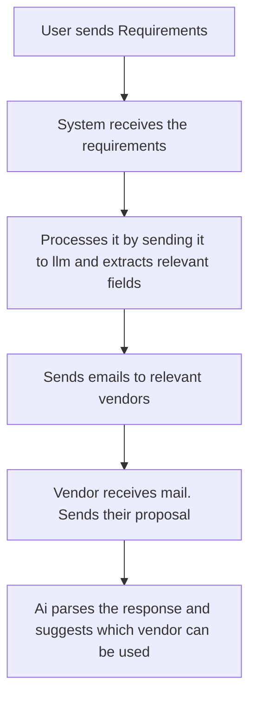

# RFP Automation System — README

## 1. Project Setup (Mandatory)

This document explains how to install, configure, and run the complete RFP Automation System, including backend, frontend, email integrations, and AI processing.

## Note

I couldnt implement vendor being able to upload pdfs or images as gemini doesnt support unlimited image uploads in free tier

---

## 1.1 Prerequisites

- **Node.js:** v18+ recommended
- **Database:** MySQL 8+
- **Package Manager:** npm
- **API Keys:**
  - Gemini (for llm response)
  - Mail provider (Gmail)
- **Git** for version control

---

## 1.2 Installation Steps

### Backend Setup

1. Clone the repo in main branch:
   ```bash
   git clone https://github.com/Parikshith-G/RFP.git
   cd backend
   ```
2. Install dependencies:
   ```bash
   npm install
   ```
3. Configure environment variables by creating a `.env` file:
   ```env
    BACKEND_PORT
    ALLOWED_ORIGINS
    DATABASE_HOST
    DATABASE_DB
    DATABASE_USER
    DATABASE_PASSWORD
    GOOGLE_API_KEY
    EMAIL_USER
    EMAIL_PASS
   ```
4. Run DB migrations:
   ```bash
    npx sequelize db:seed:all
   ```
5. Start backend:
   ```bash
   nodemon index.js
   ```

### Frontend Setup

1. Navigate to frontend folder:
   ```bash
   cd frontend
   ```
2. Install dependencies:
   ```bash
   npm install
   ```
3. Start the frontend:
   ```bash
   npm run dev
   ```

---

---

## 1.4 Running Everything Locally

### Start MySQL

```bash
 have mysql installed and configured
```

### Start Backend

```bash
cd backend
nodemon index.js
```

### Start Frontend

```bash
cd frontend
npm run dev
```

System will be available at:

- **Frontend:** http://localhost:5173/
- **Backend:** http://localhost:3000/

---

## 1.5 Seed Data / Initial Scripts

Run this to insert sample vendors

```bash
 npx sequelize db:seed:all
```

This creates:

- 5 sample vendors

---

## 2. Tech Stack

### Frontend

- React + Vite
- CSS

### Backend

- Node.js + Express
- Sequelize ORM
- Nodemailer (for sending)

### Database

- MySQL 8+

### AI Provider

- Gemini
- Used for:
  - Parsing natural-language RFPs
  - Parsing vendor proposals
  - Scoring proposals

### Email Integration

- SMTP

### Key Libraries

- `@google/genai`
- `cors`
- `dotenv`
- `express`
- `mysql2`
- `nodemailer`
- `nodemon`
- `sequelize`
- `sequelize-cli`

---

## 3. API Documentation

### **RFP Endpoints**

### GET /rfps/:id/proposals

Fetch all proposals for a given RFP, including computed scoring.

```json
{
  "rfp": {
    "id": "84b67cfd-6200-4bf4-955f-ec3cccad9900",
    "title": "Procure Laptops and Monitors for New Office",
    "category": "IT Equipment",
    "budget": "50000.00",
    "deliveryDays": 30,
    "quantity": 35,
    "structuredRfp": {
      "title": "Procure Laptops and Monitors for New Office",
      "budget": 50000,
      "category": "IT Equipment",
      "quantity": 35,
      "mailMessage": "<p>Dear Vendor,</p><p>We are seeking quotations for the supply of IT equipment for our new office. Please find the details of our requirements below:</p><h2>Procurement Details</h2><ul><li><strong>Title:</strong> Procure Laptops and Monitors for New Office</li><li><strong>Category:</strong> IT Equipment</li><li><strong>Total Budget:</strong> $50,000</li><li><strong>Desired Delivery:</strong> Within 30 days</li></ul><h3>Items Required:</h3><ul><li><strong>Laptops:</strong><ul><li>Quantity: 20</li><li>Specifications: 16GB RAM</li></ul></li><li><strong>Monitors:</strong><ul><li>Quantity: 15</li><li>Specifications: 27-inch</li></ul></li></ul><h3>Additional Terms:</h3><ul><li><strong>Payment Terms:</strong> Net 30</li><li><strong>Warranty:</strong> Minimum 1 year</li></ul><p>We look forward to receiving your competitive offer.</p><p>Sincerely,</p>",
      "delivery_days": 30,
      "structuredRfp": {
        "items": [
          {
            "type": "laptops",
            "quantity": 20,
            "specifications": {
              "RAM": "16GB"
            }
          },
          {
            "type": "monitors",
            "quantity": 15,
            "specifications": {
              "size": "27-inch"
            }
          }
        ],
        "warranty": "Minimum 1 year",
        "paymentTerms": "Net 30"
      }
    },
    "createdAt": "2025-12-05T06:56:51.000Z"
  },
  "proposals": [],
  "aiRecommendation": "No proposals have been submitted for this RFP yet."
}
```

### RFP Response from ai POST /rfps/raw-text

this method not only parses raw text but processes it and sends emails to matching vendors also

for request body

```json
{
  "userText": "I need to procure laptops and monitors for our new office.  Budget is $50,000 total. Need delivery within 30 days. We need 20 laptops with 16GB RAM and 15  monitors 27-inch. Payment terms should be net 30, and we need at least 1 year warranty"
}
```

the response

```json
{
  "message": "RFP created and sent to 2 matching vendors!",
  "rfp": {
    "id": "98208235-9d49-4749-a987-417ed174d602",
    "createdAt": "2025-12-05T07:01:03.323Z",
    "title": "Laptops and Monitors Procurement for New Office",
    "category": "IT Hardware",
    "budget": 50000,
    "deliveryDays": 30,
    "quantity": null,
    "structuredRfp": {
      "title": "Laptops and Monitors Procurement for New Office",
      "category": "IT Hardware",
      "budget": 50000,
      "delivery_days": 30,
      "quantity": null,
      "structuredRfp": {
        "items": [
          {
            "product": "Laptop",
            "quantity": 20,
            "specifications": {
              "RAM": "16GB"
            }
          },
          {
            "product": "Monitor",
            "quantity": 15,
            "specifications": {
              "size": "27-inch"
            }
          }
        ],
        "paymentTerms": "Net 30",
        "warranty": "1 year"
      },
      "mailMessage": "<!DOCTYPE html>\n<html>\n<head>\n<title>Request for Quote: Laptops and Monitors</title>\n<style>\n  body { font-family: Arial, sans-serif; line-height: 1.6; color: #333; }\n  h3 { color: #0056b3; }\n  ul { list-style-type: none; padding: 0; }\n  ul li { margin-bottom: 5px; }\n  table { width: 100%; border-collapse: collapse; margin-top: 15px; }\n  th, td { border: 1px solid #ddd; padding: 8px; text-align: left; }\n  th { background-color: #f2f2f2; }\n</style>\n</head>\n<body>\n    <p>Dear Vendor,</p>\n    <p>We are requesting a quote for the supply of laptops and monitors for our new office. Please find the details of our requirements below:</p>\n    \n    <h3>Procurement Details:</h3>\n    <ul>\n        <li><strong>Procurement Title:</strong> Laptops and Monitors Procurement for New Office</li>\n        <li><strong>Category:</strong> IT Hardware</li>\n        <li><strong>Total Budget:</strong> $50,000</li>\n        <li><strong>Required Delivery Within:</strong> 30 days</li>\n    </ul>\n\n    <h3>Item Details:</h3>\n    <table>\n        <thead>\n            <tr>\n                <th>Product</th>\n                <th>Quantity</th>\n                <th>Specifications</th>\n            </tr>\n        </thead>\n        <tbody>\n            <tr>\n                <td>Laptops</td>\n                <td>20</td>\n                <td>16GB RAM</td>\n            </tr>\n            <tr>\n                <td>Monitors</td>\n                <td>15</td>\n                <td>27-inch</td>\n            </tr>\n        </tbody>\n    </table>\n\n    <h3>Additional Requirements:</h3>\n    <ul>\n        <li><strong>Payment Terms:</strong> Net 30</li>\n        <li><strong>Warranty:</strong> At least 1 year</li>\n    </ul>\n\n    <p>Please submit your comprehensive quote detailing itemized costs, lead times, and any other relevant information based on the above specifications.</p>\n    <p>We look forward to your prompt response.</p>\n    <p>Sincerely,</p>\n    <p>Procurement Team</p>\n</body>\n</html>"
    }
  },
  "vendorsSentTo": ["Service 5", "Service 4"]
}
```

### **Proposal Endpoints**

the ai parses raw text from vendor and stores it in db
for request body

```
{
    "rfpId": "98208235-9d49-4749-a987-417ed174d602",
    "vendorId": "82c47d3c-e125-4ce6-873b-659dc324df76",
    "rawProposalText": "Our final price for the 20 laptops and 15 monitors is sixty thousand dolalrs, which is payable on Net 25 terms. We guarantee a 3-year warranty and can commit to delivery in 10 days flat. The laptop model is the HP."
}
```

the response

```json
{
  "message": "Proposal successfully parsed and stored.",
  "proposal": {
    "id": "c61273d3-2693-451e-b11f-1ce07e5bde1c",
    "createdAt": "2025-12-05T07:03:21.162Z",
    "rfpId": "98208235-9d49-4749-a987-417ed174d602",
    "vendorId": "82c47d3c-e125-4ce6-873b-659dc324df76",
    "totalPrice": 60000,
    "deliveryDays": 10,
    "quantity": 35,
    "parsed": {
      "total_price": 60000,
      "delivery_days": 10,
      "quantity": 35,
      "warranty_years": 3,
      "payment_terms": "Net 25",
      "parsed_details": {
        "products": [
          {
            "item": "laptops",
            "quantity": 20,
            "model": "HP"
          },
          {
            "item": "monitors",
            "quantity": 15
          }
        ]
      }
    }
  }
}
```

## 4. Decisions & Assumptions

### 4.1 Key Design Decisions

- **Structured RFP model** contains parsed JSON for easy comparison.
- **Proposal model** stores both raw and LLM-parsed content.
- **Vendor table** includes categories for automated routing.
- **Scoring algorithm** balances:
  - Price
  - Delivery time
  - Quality indicators from LLM

---

### 4.2 Assumptions

- Vendors send proposals in human text.
- Email bodies may contain plain text.
- Budget and delivery days are always present in the RFP.
- All values are in consistent units ($ and days).

---

## 5. AI Tools Usage

### 5.1 Tools Used

- **GEMINI**

### 5.3 Prompts / Approaches

- "Convert natural-language RFP to JSON structure"
- "Convert JSON structure to natural-language RFP"

### 5.4 Learnings

- AI is excellent for scaffolding repetitive code.
- LLM-based parsers require guardrails (regex + schema validation).
- AI helps debug faster but system design still requires human reasoning.

---

### 5.5 To Be implemented / Can be Optimized

- There is no authentication for users or vendors
- Currently from frontend i poll backend every 15 seconds for new proposals but this is very inefficient
- Scoring formula is very simple and not normalized

### Mermaid Diagram



## End of README
